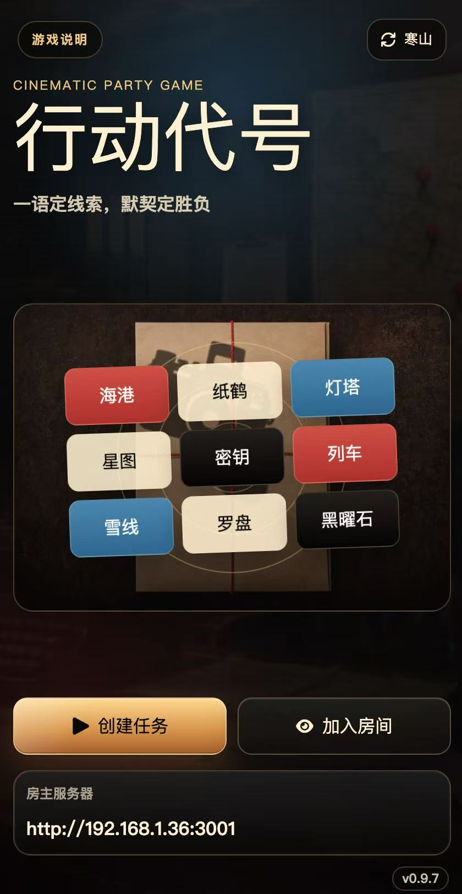
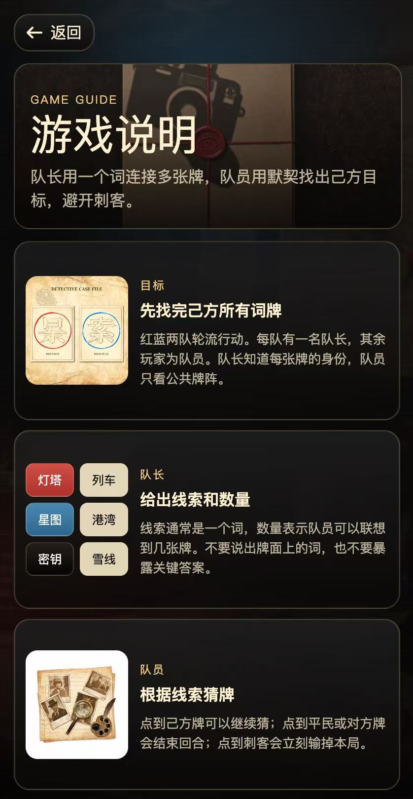
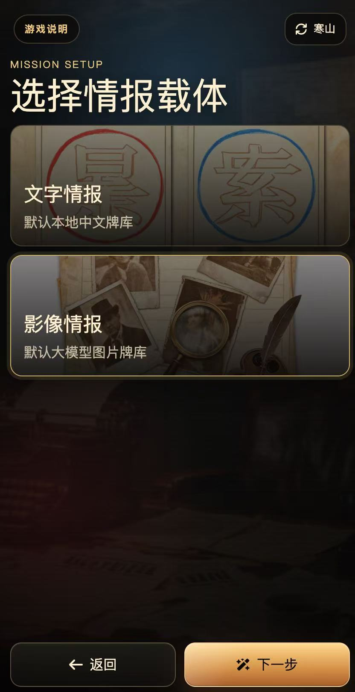
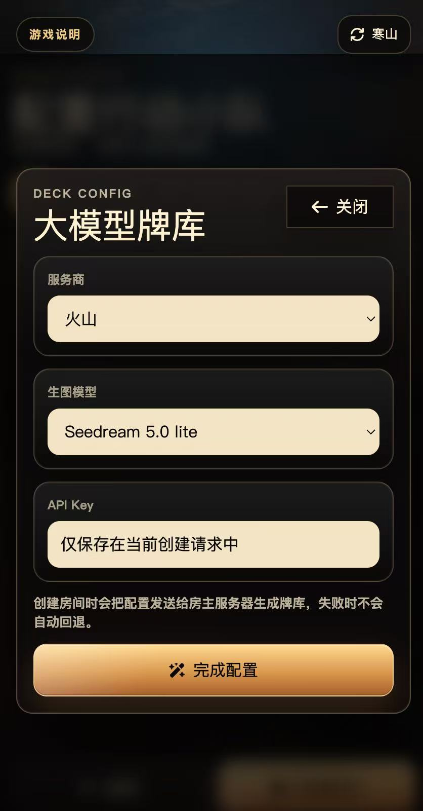
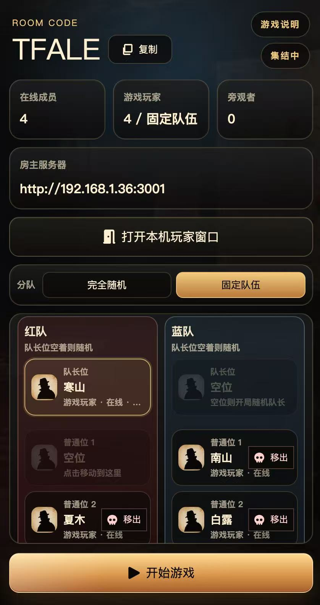
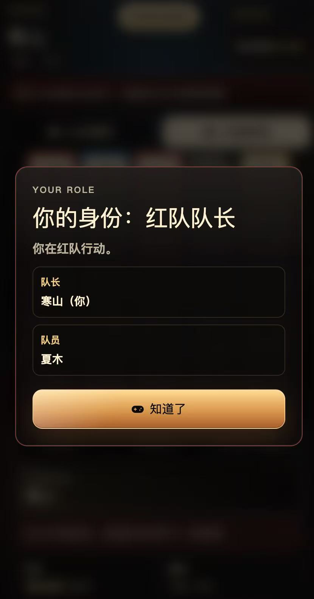
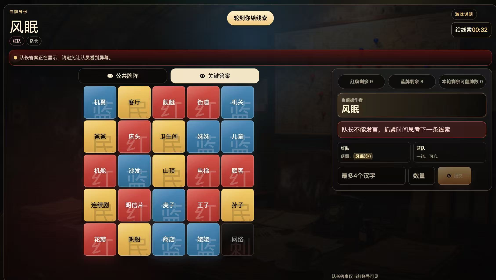
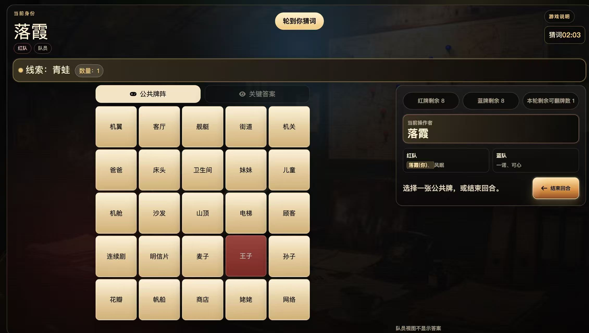
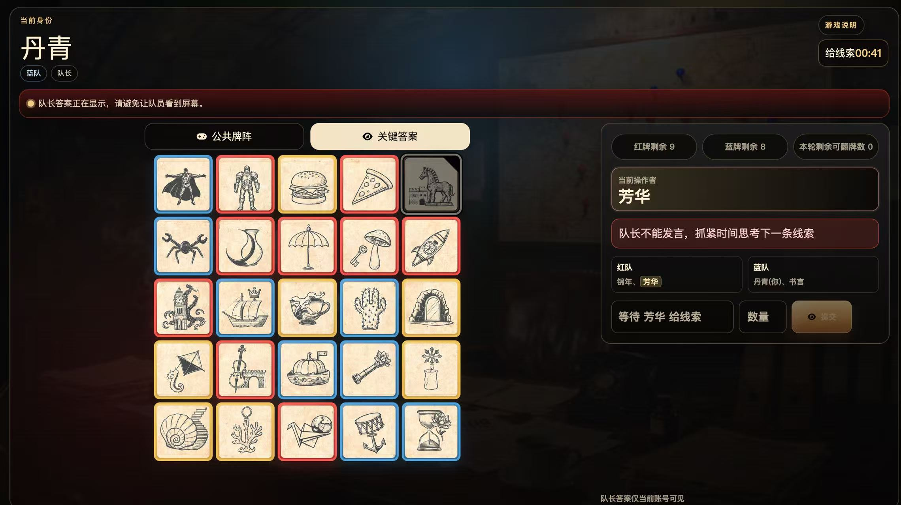
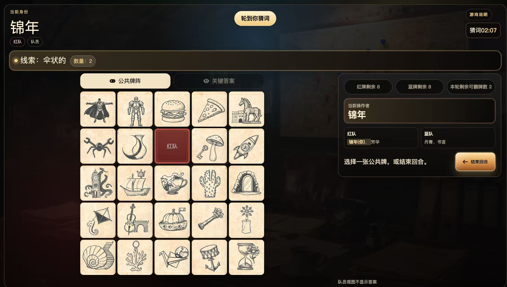

# 行动代号

中文优先的《行动代号 / Codenames》线上发牌与对局工具。房主创建房间后，玩家用房间码或链接加入；系统负责发牌、分队、队长视角、队员视角、线索提交、翻牌和胜负结算。

当前版本：`0.9.7`

## 这是什么游戏？

《行动代号》是一个红蓝两队对抗的联想猜词游戏：

- 每局固定 `5x5`、共 `25` 张牌。
- 红蓝两队各有一名队长，其余玩家是队员。
- 队长能看到每张牌属于红队、蓝队、平民还是刺客。
- 队长每回合给出一个线索和数量，队员根据线索猜牌。
- 猜到己方牌可以继续；猜到平民或对方牌会结束回合；猜到刺客立即失败。
- 红队固定先手，红队 `9` 张目标牌，蓝队 `8` 张目标牌。

这个项目把线下桌游需要的发牌员、钥匙卡、同步状态和主持流程都放到网页里，适合同一局域网聚会、桌面端主持、投屏或多人手机加入。

## 核心特点

- 中文界面和中文词牌，开箱即可玩。
- 支持文字情报和影像情报两种牌库。
- 文字模式固定使用本地中文词牌，不需要 API Key。
- 图片模式支持本地图片牌，也支持大模型生成图片牌阵。
- 固定队伍模式提供红队、蓝队、队长位、普通位和旁观位。
- 队长/队员视角严格隔离，队员不会看到关键答案。
- 支持房间重连、房主转移、返回等候房间和重新发牌。
- 可作为普通 Web 应用运行，也可打包为 Electron 桌面宿主。
- 支持服务器容器部署，单镜像、单端口、同源托管前端和 Socket.IO。

## 游戏截图

### 首页与说明

打开游戏后可以直接创建任务、加入房间，或先查看游戏说明。页面会显示房主服务器地址，方便同一网络下的玩家加入。

<p>
  
  
</p>

### 创建房间

房主先选择情报载体：文字情报适合经典猜词；影像情报适合图片联想。图片大模型牌库会在创建前配置服务商、模型和 API Key，密钥只随当前创建请求发送给房主服务器。

<p>
  
  
</p>

### 等候房间与固定队伍

房间内会显示房间码、在线成员、玩家数量和房主服务器地址。固定队伍模式下，玩家可以进入红蓝队、队长位、普通位或旁观位；房主确认人数和座位后开始游戏。

<p>
  
  
</p>

### 文字牌局

队长可以切换到关键答案视图，看到每张文字牌的阵营；队员只看到公共牌阵。线索必须是 `1` 到 `4` 个汉字，数量必须大于 `0`，并且文字模式会校验线索不能撞牌面字。

<p>
  
</p>

<p>
  
</p>

<p>
  
</p>

### 图片牌局

图片模式使用 `25` 张图片牌，队长看到关键答案，队员只看公共图片牌。图片线索不会按隐藏 alt 文本做撞字校验，UI 也不会把图片提示词暴露给玩家。

<p>
  
</p>

<p>
  
</p>

<p>
  
</p>

## 一局怎么玩？

1. 房主打开入口页或桌面版，创建房间。
2. 选择文字情报或影像情报。
3. 等候房间里选择完全随机或固定队伍。
4. 把房间码或入口链接发给玩家。
5. 图片大模型模式下，房主先生成并确认图片牌阵，再开始游戏。
6. 开局后每位玩家确认自己的身份。
7. 队长查看关键答案，给出线索和数量。
8. 队员根据线索选择公共牌阵上的牌，或主动结束回合。
9. 点中刺客或一方目标牌全部揭示后，游戏结算。

## 本地运行

需要 Node.js 和 `corepack pnpm`。在仓库根目录执行：

```bash
corepack pnpm install
corepack pnpm dev
```

默认端口：

- 服务端：`3001`
- 游戏前端：`5173`
- 入口页：`5174`

常用局部启动：

```bash
corepack pnpm --filter @codenames/server dev
corepack pnpm --filter @codenames/web dev
corepack pnpm --filter @codenames/entry dev
```

局域网调试时，请确保房主电脑防火墙放行 Node.js 和服务端端口。

## 桌面版

桌面版采用 Hosted Server 架构：启动后在房主电脑本机开启服务，其他设备访问房主服务器地址即可加入。默认端口是 `3210`，如果端口被占用会自动尝试后续端口。

```bash
corepack pnpm desktop:dev
```

打包命令：

```bash
corepack pnpm desktop:pack
corepack pnpm desktop:dist
```

## 服务器容器部署

服务器部署使用单镜像、单端口、同源模式。容器内由 Express 同时托管游戏页 `/`、入口页 `/entry/`、HTTP API 和 Socket.IO，默认监听 `3001`。

```bash
docker build -t codenames:0.9.7 .
docker run -d \
  --name codenames \
  --restart unless-stopped \
  -p 3001:3001 \
  codenames:0.9.7
```

健康检查：

```bash
curl http://127.0.0.1:3001/health
```

公网部署时，建议用 Nginx、Caddy 或云厂商负载均衡把 HTTPS 域名反向代理到 `127.0.0.1:3001`，并确保 WebSocket upgrade 生效。入口页地址通常是：

```text
https://你的域名/entry/
```

## 牌库与模型

文字模式：

- 固定走本地中文词牌。
- 创建房间时不展示大模型牌库配置。
- 不需要任何 API Key。

图片模式：

- 本地牌库使用 `apps/web/public/fallback-image-cards/` 下的 `25` 张 WebP 图片。
- 图片大模型当前支持 OpenAI 图片生成和火山 `Seedream 5.0 lite`。
- 火山模型 ID：`doubao-seedream-5-0-260128`。
- OpenAI 图片模型 ID：`gpt-image-2`。
- 通义图片模型、Seedream 4.x 已从当前图片模式中移除。
- API Key 只用于当前房间创建/生图流程，不应写入仓库。
- 大模型生成失败时不会自动回退到本地牌库。

## 项目结构

```text
apps/entry       入口/邀请页
apps/web         React + Vite 游戏前端
apps/server      Express + Socket.IO 服务端
apps/desktop     Electron 桌面宿主
packages/shared  共享类型、schema 和 Socket 协议
packages/game-core 纯游戏规则和状态机
```

规则逻辑放在 `packages/game-core`，协议和类型放在 `packages/shared`，UI 放在 `apps/web` 或 `apps/entry`，服务端行为放在 `apps/server`。

## 开发验证

发布或合并前建议运行：

```bash
corepack pnpm lint
corepack pnpm test
corepack pnpm build
```

常用局部验证：

```bash
corepack pnpm --filter @codenames/server test
corepack pnpm --filter @codenames/game-core test
corepack pnpm --filter @codenames/web lint
corepack pnpm --filter @codenames/desktop lint
corepack pnpm desktop:build
```

## 安全注意

- 不要提交 API Key、真实密钥或本地环境文件。
- 大模型 Key 通过 UI 输入，仅用于当前房间创建/生成流程。
- `release/`、`generated/`、临时 QA 目录和本地参考资料不要随手提交。
